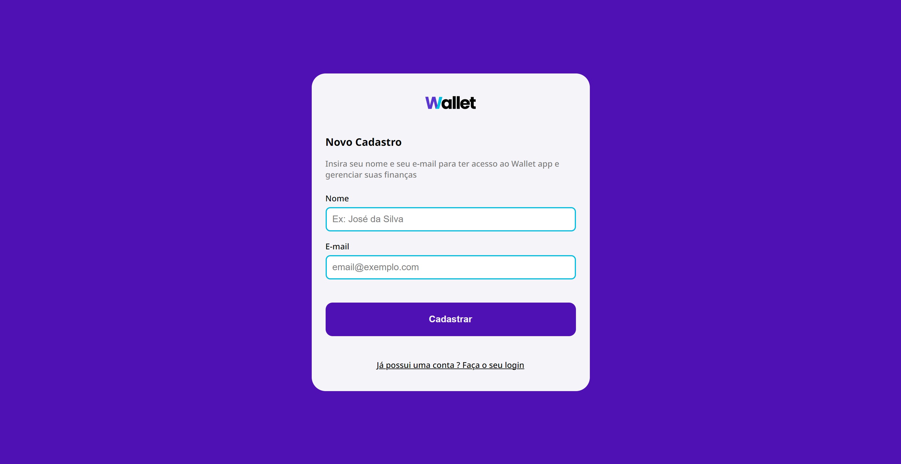
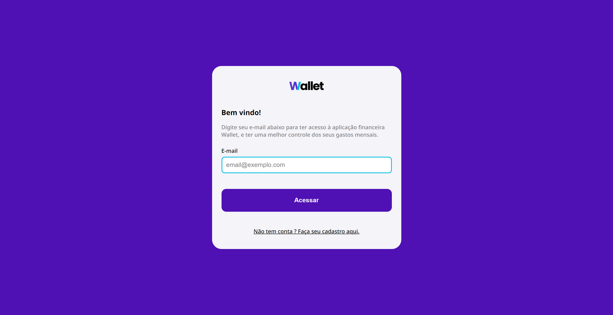
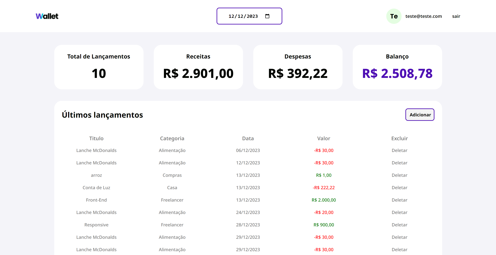
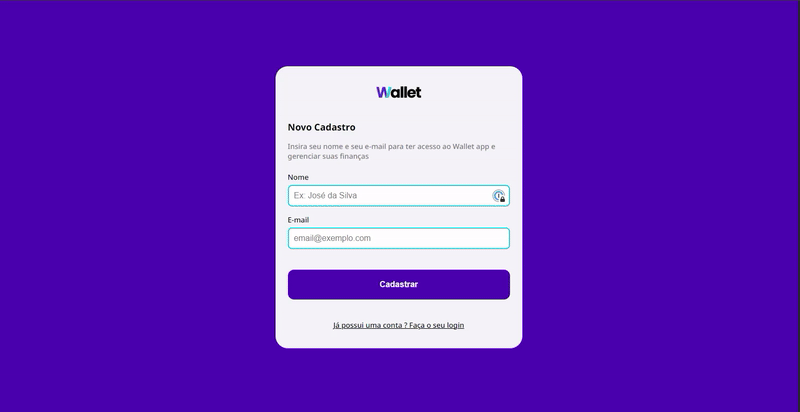
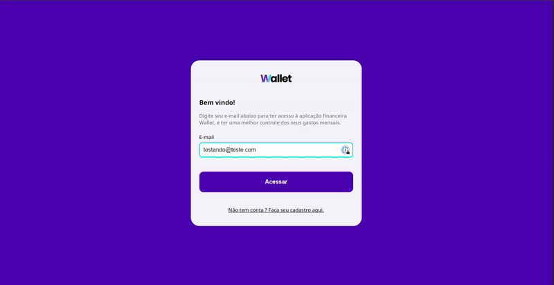

<h1 align="center"> Aplicativo de Controle Financeiro: Organize suas Finanças com Facilidade </h1>

 Este o primeiro projeto que foi desenvolvido como parte do curso "Mapa da Programação", onde utilizei o Figma como base para criar um aplicativo de controle financeiro. Com HTML, SCSS e JavaScript, transformei o design em uma aplicação interativa e responsiva. Além das funcionalidades de login e cadastro de e-mail para acesso, o aplicativo permite registrar seus gastos e ganhos, proporcionando uma organização eficiente das finanças pessoais. 

 

## Tecnologias usadas

- Javascript
- HTML
- SCSS
- Figma

## Resumo

- [Screenshots](#Screenshots)
- [Responsividade](#Responsividade)
- [Link](#LINK)

## Screenshots

 

  
  
  

   

 

## Responsividade

 

 

### Live Link
https://murll0.github.io/finances_app/