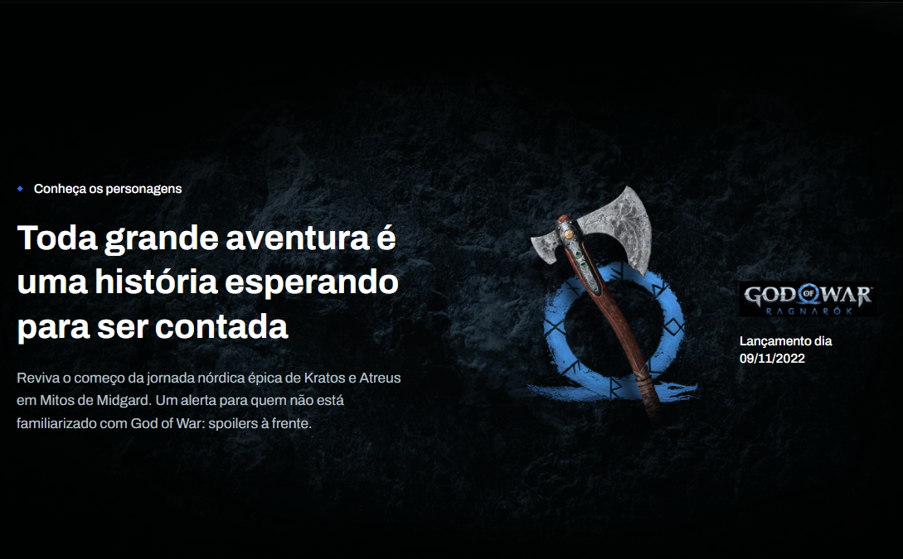

# 
 Site Responsivo Criado a partir do Design do Figma usando HTML e SCSS 

 Este projeto consiste em um site que foi desenvolvido utilizando HTML e SCSS, com base em um design obtido no Figma. O objetivo era transformar o design em um site funcional e responsivo.

 

## Resumo

- [Screenshots](#Screenshots)
- [Visão Geral/Responsividade](#VisãoGeral/Responsividade)
- [Links](#LINK:)

## Screenshots

 

 
 
 
 

 

## Visão Geral/Responsividade

 

  

### LINK: http://murll0.github.io/God_of_War
