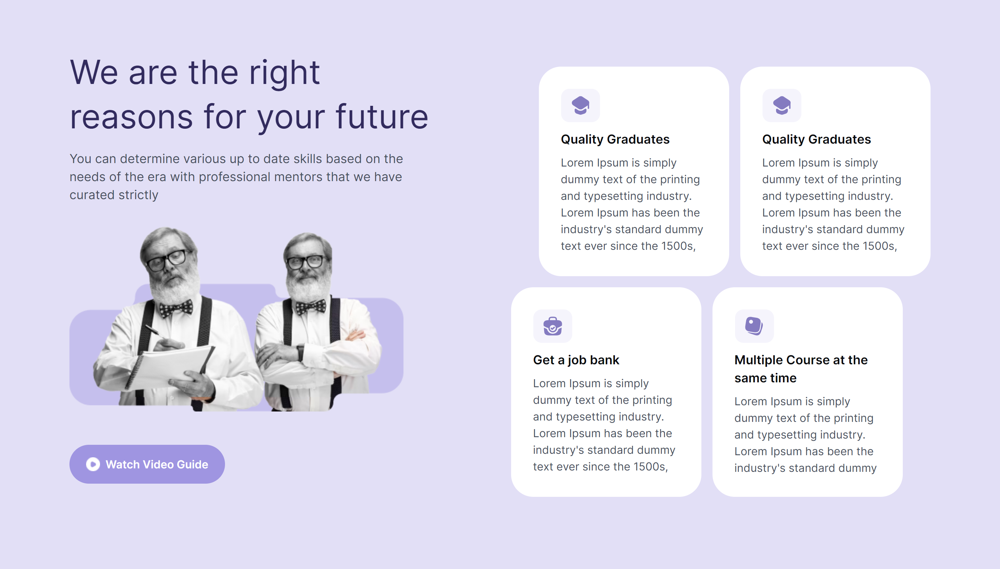
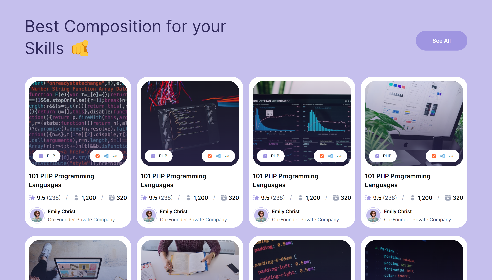
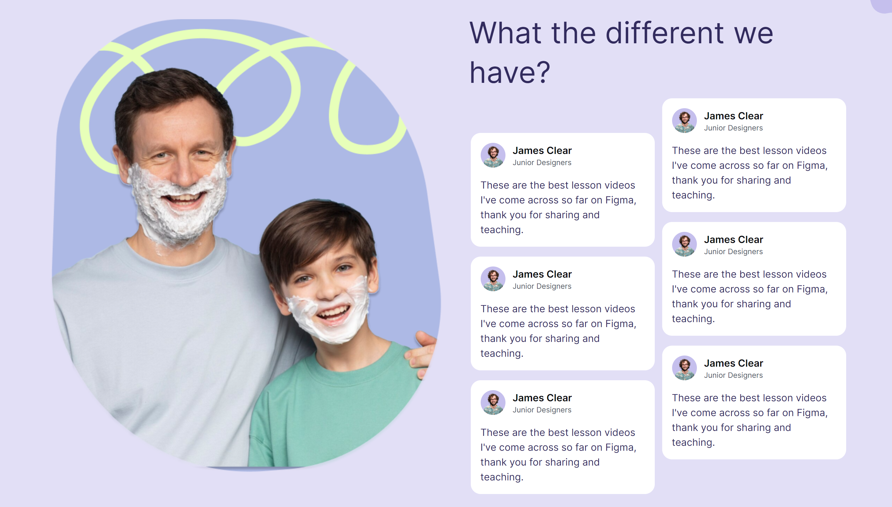
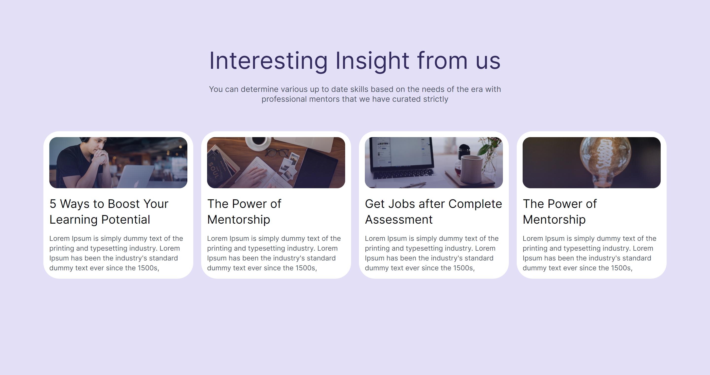
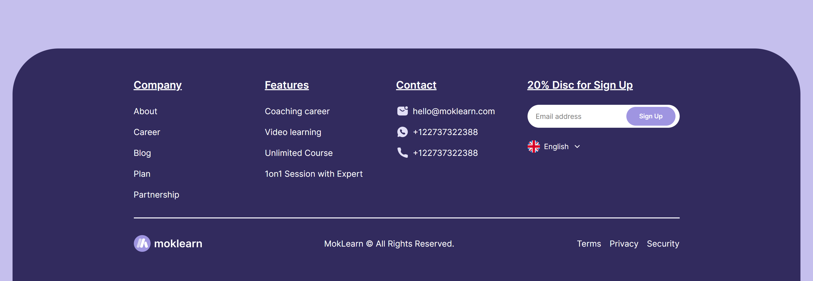

<h1 align="center">Site Responsivo Criado a partir do Design do Figma usando HTML e SCSS</h1>

Este projeto consiste em um site que foi desenvolvido utilizando HTML e SCSS, com base em um design obtido no Figma. O objetivo era transformar o design em um site funcional e responsivo.

 

## Resumo

- [Screenshots](#Screenshots)
- [Responsividade](#Responsividade)
- [Link](#LINK)

## Screenshots

 

 

## Responsividade

 

 

 

### LINK

https://murll0.github.io/Moklearn/