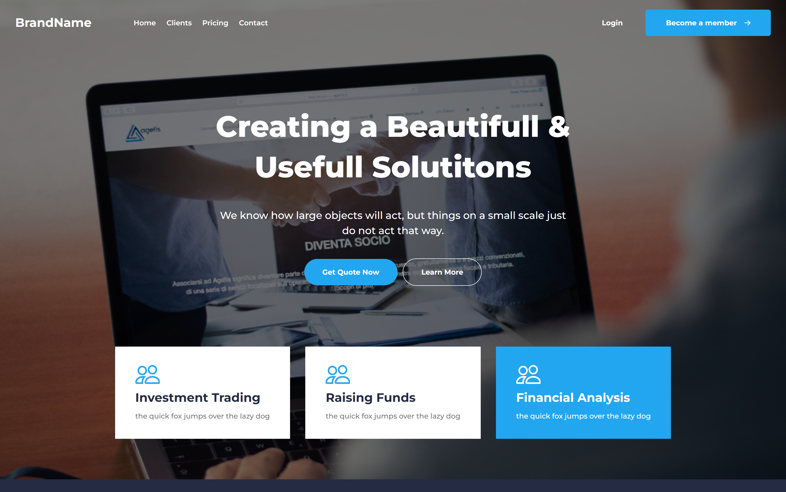
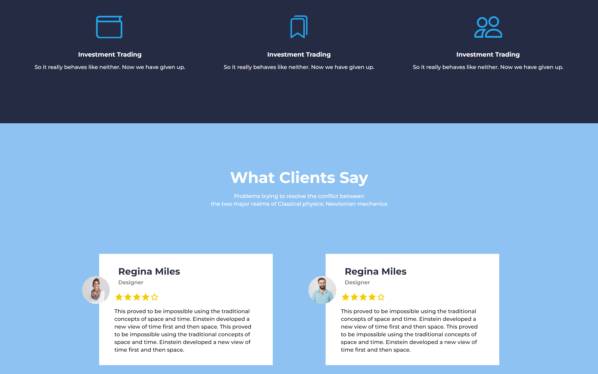
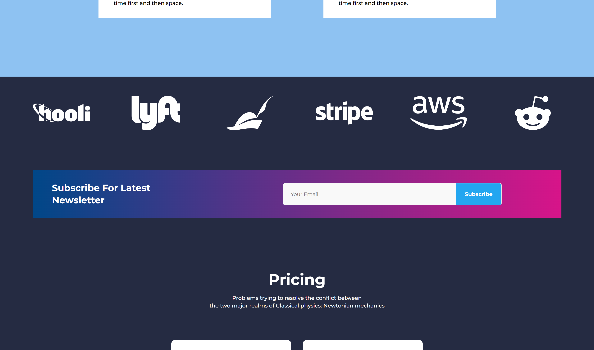
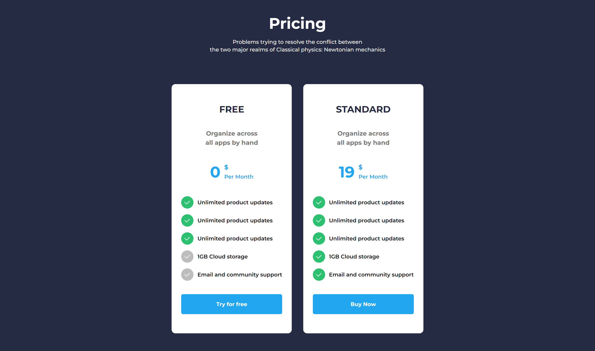

<h1 align="center">Site Responsivo Criado a partir do Design do Figma usando HTML, SCSS e JavaScript</h1>

Este projeto consiste em um site funcional e responsivo desenvolvido com base em um design obtido no Figma. Utilizando HTML, SCSS e JavaScript, transformamos o design em um site interativo, com funcionalidades dinâmicas e adaptado para diferentes dispositivos.

 

## Resumo

- [Screenshots](#Screenshots)
- [Responsividade](#Responsividade)
- [Link](#LINK)

## Screenshots

 

 

## Responsividade

 

 

### LINK
https://murll0.github.io/finance
