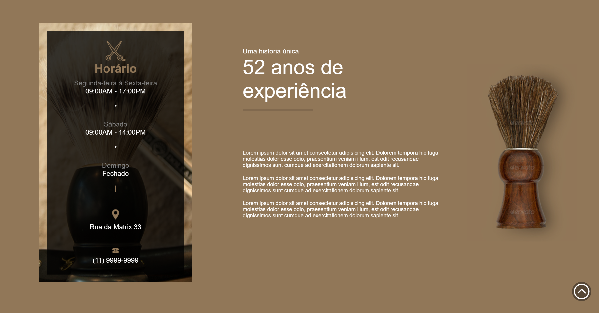

<h1 align="center"> Site Responsivo usando HTML, SCSS e JavaScript </h1>

 

## Resumo

- [Screenshots](#Screenshots)
- [Responsividade](#Responsividade)
- [Link](#LINK)

## Screenshots

 

 

## Responsividade

 

 

### LINK

https://bit.ly/barbearia_shop